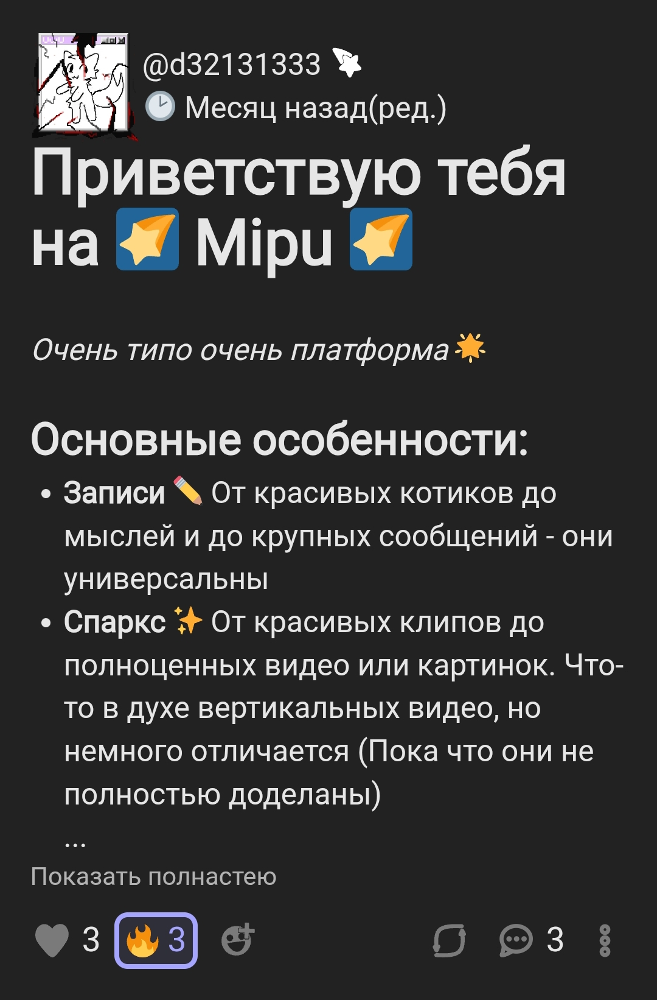
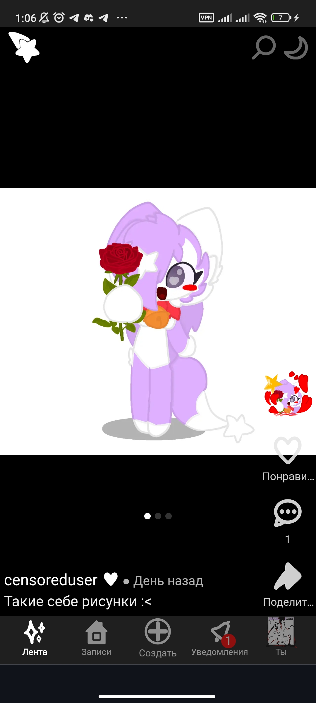

# Mipu - Not just falling star
(клиент)

## Представление
### Краткое описание
- Mipu - это одностраничное прогрессивное веб-приложение, которое использует почти все возможности веб-технологий, в основном работает на технологиях React

### Возможности
- **Текстовые записи ✏️**: Остадавайте любую мысль, или делитесь с чем-то интересным, включая картинки с котиками :D
 - 
- **Вертикальные посты(Sparks) ✨**: Чем-то похожий, хотя может и целый клон знакомого многими формат из TikTok или YouTube Shorts. Но что интересно, это реализовано в вебе
 - 
 - 

### Цель
В основном, каждый проект имеет цель в том, чтобы решить какую-ту конкретную проблему. Но я в 2022 году, впервые изучая основы веб-разработчки и впервые начиная пытаться лепить подобие соцсети, **я не ставил особо конкретную проблему**

Но в целом, начиная с 2025 года моей целью стало просто ***создать что-то воистину интересное***, что в целом позволило бы порадовать многих. Немного подробнее будет уже в подтитуле со случайными фактами


### Другие особенности:
1. Эмодзи. Здесь используется Twemoji а также собственная система кастомных эмодзи, который при возможности можно даже использовать, как стикеры, но пока что это все настолько сыро
2. Реакции. Как в Slask или Discord, но только применимо к текстовым постам и комментариям
3. Комментарии. Почти что такие же, как и текстовые посты
 - **Но**: Здесь есть какая-никакая система комментариев в режиме реального времени, но это скорее всего как для галочки, так как пока что довольно много есть недочетов с ними. Да и довольно много недочетов в целом
 - 

### Случайные факты:
1. Веб-приложение было названо в честь кого-то, но кто именно, я уже не помню
2. Некоторые места были навайбкодены, а другие многие места писались почти без лишней опоры на StackOverflow или нейросетевых ассистентов
3. Настоящая дата основания датуется еще *4 августа 2022 года*. За этот промежуток это веб-приложение несколько раз переписывалось, включая даже бэкенд. Сама React-версия была основана еще *8 ‎сентября ‎2024 ‎года*
4. Насчет вайб-кодинга. За промежуток с даты основания со мной имели дело почти все популярные чат-ассистенты, которые были в то время актуальными
5. В веб-приложении присутствует почти что переделанный Markdown-синтаксис, где полностью урезана функция сокращения переносов
6. Падающая звезда меня ассоциирует много с чем, поэтому я решил посвятить этому целый логотип для веб-приложения
7. Скорее всего, это веб-приложение неоптимизировано, а здесь вся эта база будет напоминать на треш-код
8. *Во многом я писал это веб-приложение сам, единолично, в одиночку*
9. *Бюджет разработки оценивается в один плиточный шоколад*
10. Кодовое название этого веб-приложения: MipuClient_reborn
11. Я писал рендерер в формате веб1 для индексации. Но из-за домена я практически никак даже протестировать не могу
12. Со временем разработки в продолжительное время уже дошло все до того, что я начинаю связывать смысл жизни с этим веб-приложением
13. Я довольно часто страдаю от того, что мой контент в TikTok и в YT Shorts практически низковиральные и умирают практически за считанные дни. Хотя в 2026 году ситуация с TikTok стало более менее, в 2025 году это побудило меня попробовать создать свою систему с вертикальными постами, где мой контент в целом мог бы жить долго(ну, почти)
14. Довольно долгое время я предопределял веб-приложение только к текстовым записям, хотя я и хотел, чтобы это стало чем-то центром развлечения. Почти что как Twitter долгое время, хотя это пожожим назвать аж язык не поворачивается
15. Изначально идея с вертикальными постами появилась из-за желания где-то хранить видео, сделанные через нейросеть OpenAi Sora, и бредо-контент, который я делаю, желая, чтобы их хоть кто-то смотрел и вспоминал. *Но потом я понял, что такой особо контент долго не живет*
16. Знакомство с React подарило мне возможность написать ленту Sparks, что ранее было вообще невозможно, и о этом вообще не думал

## Установка:
Если по какой-то причине вам надо установить фронтенд Mipu локально для какой-то цели, например, что-то модифицировать, то в целом это приветствуется

**НО:** Туториал в целом не включает бэкенд и его настройку, где включена настройка MySQL-базы. На момент написания бэкенд(rest-API, socket-API, мадиахранилище, датабаза) пока что в закрытом доступе, но, в целом, когда-нибудь и что-то произойдет

### Установка Mipu
1. Создайте какую-либо директорию
 - `mkdir mipucore`
2. Создайте `config.json`
 - Настройка. Будет в отдельном титуле
3. Склонируйте эту репозиторию:
 - `git clone`
 - Ну или просто скачайте архивом и распакуйте в том директории
4. Перейдите в репозиторию и установите зависимости
 - `npm i --force`
5. После этого можно запустить веб-приложение
 - `node index`
6. Подождите немного
 - В этот промежуток происходит сборка скриптов в `bundle.js`
 - При успешной инициализации в консоль высветится `[INFO] Successfully generated webpack scripts. To refresh scripts, reload this web server`
7. После этого можно зайти. По умолчанию сервер распологается по адресу `http://localhost:80`

### Настройка
Этому веб-приложению нужны самые минимальные данные для работы, поэтому в `config.json` нужно расписать следующее
```
{
 "frontend_host": "8000",
 "frontend_apis": {
  "api": "http://localhost:6382/",
  "media": "http://localhost:6383/"
 },
 "frontend_media_external_url": "http://localhost:6383/"
}
```
Родной средой для Mipu является Windows, поэтому по-умолчанию он будет пытаться прослушивать порт *:80*, а на Linux(включая даже Android) для такого потребуются root-привилегии
В большей части, вряд ли что-то еще нужно

По-умолчанию localhost в fontend_apis заменяется на используемый хост с надлежащим протоколом (либо http, либо https)
Параметр `frontend_media_external_url` нужен для модуля `web10renderer.js`, так как там не используется ни один JavaScript-код. Он не используется для самого веб-приложения. Замените этот параметр на внешний юрл медиахранилища, чтобы метаданные ссылки корректно отображали пользовательский контент

Если верить нынешним данным, то для соединения с бэкендом Mipu нужно в качестве API указать `https://mipuwu.mooo.com/api/` и в качестве медиахранилища(и какв качетсве внешнего юрл) указать `https://mipuwu.mooo.com/media/`. Но правда, я не до конца помню детали со своей же CORS-политикой

# Вердикт
Да, это довольно сырое веб-приложение, которое я пишу в одиночку, поэтому, возможно, такое себе


## ✨ Надеюсь, вам это понравится ✨
(Я конечно сомневаюсь, что это хоть кому-то понравится, так как щас в эпоху ИИ многие труды разработчиков просто обесцениваются. И это веб-приложение, скорее всего, можно через нейронку переписать за 3 часа, и даже в лучшую сторону. Да хотя я и сам не отрицаю, что я использую чат-ассистентов для того, чтобы решать некоторые проблемы с программированием, да, на JavaScript, насколько бы странным это ваще не казалось)
